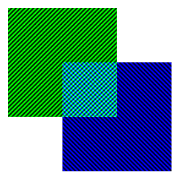
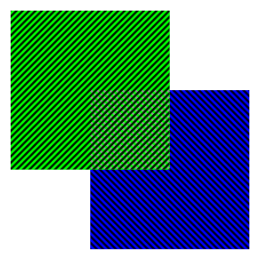
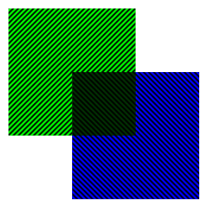

# background-blend-mode

Свойство **`background-blend-mode`** описывает то, как фоновое изображение элемента должно накладываться на фоны других элементов.

??? info "Фон"

    <div class="col3" markdown="1">

    - [background](background.md)
    - [background-attachment](background-attachment.md)
    - **background-blend-mode**
    - [background-clip](background-clip.md)
    - [background-color](background-color.md)
    - [background-image](background-image.md)
    - [background-origin](background-origin.md)
    - [background-position](background-position.md)
    - [background-position-x](background-position-x.md)
    - [background-position-y](background-position-y.md)
    - [background-repeat](background-repeat.md)
    - [background-size](background-size.md)

    </div>

??? info "Изображения, фильтры, композиция"

    <div class="col3" markdown="1">

    - [image-orientation](image-orientation.md)
    - [image-rendering](image-rendering.md)
    - [image-resolution](image-resolution.md)
    - [object-fit](object-fit.md)
    - [object-position](object-position.md)

    </div>

    <div class="col3" markdown="1">

    - [linear-gradient()](linear-gradient.md)
    - [radial-gradient()](radial-gradient.md)
    - [repeating-linear-gradient()](repeating-linear-gradient.md)
    - [repeating-radial-gradient()](repeating-radial-gradient.md)
    - [conic-gradient()](conic-gradient.md)
    - [repeating-conic-gradient()](repeating-conic-gradient.md)
    - [url()](url.md)
    - [element()](element.md)
    - [image()](image.md)
    - [cross-fade()](cross-fade.md)

    </div>

    <div class="col3" markdown="1">

    - [backdrop-filter](backdrop-filter.md)
    - [filter](filter.md)

    </div>

    <div class="col3" markdown="1">

    - **background-blend-mode**
    - [isolation](isolation.md)
    - [mix-blend-mode](mix-blend-mode.md)

    </div>

## Синтаксис

```css
background-blend-mode: normal; /* Одно значение */
background-blend-mode: darken, luminosity; /* Два значение, по одному на каждый фон */

background-blend-mode: initial;
background-blend-mode: inherit;
background-blend-mode: unset;
```

## Значения

`blend-mode`
: Собственно режим смешивания. Может быть задано несколько значений через запятую.

Значение по-умолчанию:

```css
background-blend-mode: normal;
```

## Спецификации

- [Compositing and Blending Level 1](https://drafts.fxtf.org/compositing-1/#background-blend-mode)

## Поддержка браузерами

<p class="ciu_embed" data-feature="css-backgroundblendmode" data-periods="future_1,current,past_1,past_2">
  <a href="http://caniuse.com/#feat=css-backgroundblendmode">Can I Use css-backgroundblendmode?</a> Data on support for the css-backgroundblendmode feature across the major browsers from caniuse.com.
</p>

## Описание и примеры

### normal


Конечный цвет — это верхний цвет, независимо от того, что представляет собой нижний цвет. Эффект подобен двум непрозрачным кускам бумаги, перекрывающимся друг над другом.

### multiply


Конечный цвет — результат умножения верхнего и нижнего цветов. Черный слой приводит к черному окончательному слою, а белый слой не приводит к изменению. Эффект подобен двум изображениям, нанесенным на прозрачную пленку.

### screen


Конечный цвет является результатом инверсии цветов, их умножения и инвертирования этого значения. Черный слой не приводит к изменению, а белый слой приводит к белому окончательному слою. Эффект подобен двум изображениям, сияющим на экране проекции.

### overlay


Конечный цвет — результат `multiply`, если нижний цвет темнее или `screen`, если нижний цвет светлее. Этот режим смешивания эквивалентен `hard-light`, но со слоем обмена.

### darken


Конечный цвет состоит из самых темных значений каждого цветового канала.

### lighten


Конечный цвет состоит из самых светлых значений каждого цветового канала.

### color-dodge


Конечный цвет — результат деления нижнего цвета на обратный верхний цвет. Черный передний план не приводит к изменению. Передний план с обратным цветом фона приводит к полностью освещенному цвету.

Этот режим смешивания похож на `screen`, но передняя часть должна быть только такой же cdtnkjq, как обратная сторона фона, чтобы создать полностью освещенный цвет.

### color-burn


Конечный цвет является результатом инвертирования нижнего цвета, деления значения на верхний цвет и инвертирования этого значения. Белый передний план не дает никаких изменений. Передний план с обратным цветом фона приводит к черному окончательному изображению.

Этот режим смешивания аналогичен `multiply`, но переднего плана нужно только быть темным, как обратное к фону, чтобы сделать окончательное изображение черным.

### hard-light


Конечный цвет — результат `multiply`, если верхний цвет темнее или `screen`, если верхний цвет светлее. Этот режим смешивания эквивалентен `overlay`, но со слоем обмена. Эффект подобен сиянию сурового прожектора на заднем плане.

### soft-light


Конечный цвет похож на `hard-light`, но мягче. Этот режим смешивания ведет себя аналогично `hard-light`. Эффект подобен сиянию рассеянного прожектора на заднем плане.

### difference



Конечный цвет — результат вычитания более темного из двух цветов из более светлого. Черный слой не действует, а белый слой инвертирует цвет другого слоя.

### exclusion


Конечный цвет похож на `difference`, но с меньшим контрастом. Как и `difference`, черный слой не действует, а белый слой инвертирует цвет другого слоя.

### hue


Конечный цвет имеет оттенок верхнего цвета, используя насыщенность и светимость нижнего цвета.

### saturation



Конечный цвет имеет насыщенность верхнего цвета, используя оттенок и светимость нижнего цвета. Чистый серый фон, без насыщения, не будет иметь никакого эффекта.

### color


Конечный цвет имеет оттенок и насыщенность верхнего цвета, при этом используется яркость нижнего цвета. Эффект сохраняет уровни серого и может использоваться для раскрашивания переднего плана.

### luminosity



Конечный цвет имеет яркость верхнего цвета, используя оттенок и насыщенность нижнего цвета. Этот режим смешивания эквивалентен `color`, но при этом слои меняются местами.
