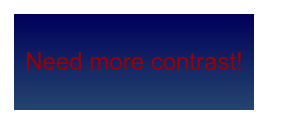

# color-adjust

Свойство **`color-adjust`** устанавливает, что может сделать пользовательский агент, чтобы оптимизировать внешний вид элемента на устройстве вывода.

По умолчанию браузеру разрешено вносить любые изменения во внешний вид элемента, который он считает необходимым и разумным, учитывая тип и возможности устройства вывода.

??? info "Шрифт и Цвет"

    <div class="col3" markdown="1">

    - [@font-face](font-face.md)

    </div>

    <div class="col3" markdown="1">

    - [font](font.md)
    - [font-family](font-family.md)
    - [font-feature-settings](font-feature-settings.md)
    - [font-kerning](font-kerning.md)
    - [font-language-override](font-language-override.md)
    - [font-optical-sizing](font-optical-sizing.md)
    - [font-size](font-size.md)
    - [font-size-adjust](font-size-adjust.md)
    - [font-stretch](font-stretch.md)
    - [font-style](font-style.md)
    - [font-synthesis](font-synthesis.md)
    - [font-variant](font-variant.md)
    - [font-variant-alternates](font-variant-alternates.md)
    - [font-variant-caps](font-variant-caps.md)
    - [font-variant-east-asian](font-variant-east-asian.md)
    - [font-variant-ligatures](font-variant-ligatures.md)
    - [font-variant-numeric](font-variant-numeric.md)
    - [font-variant-position](font-variant-position.md)
    - [font-variation-settings](font-variation-settings.md)
    - [font-weight](font-weight.md)
    - [line-height](line-height.md)

    </div>

    <div class="col3" markdown="1">

    - [color](color.md)
    - **color-adjust**
    - [opacity](opacity.md)

    </div>

## Синтаксис

```css
color-adjust: economy;
color-adjust: exact;
```

## Значения

`economy`
: Пользовательскому агенту разрешено вносить изменения в элемент, если он считает это целесообразным и разумным, чтобы оптимизировать вывод для устройства, для которого он отображается. Например, при печати браузер может отказаться от всех фоновых изображений и настроить цвета текста, чтобы убедиться, что контрастность оптимизирована для чтения на белой бумаге. Это по умолчанию.

`exact`
: Содержимое элемента было специально и тщательно продумано, чтобы использовать цвета, изображения и стили вдумчивым и / или важным образом, чтобы изменение в браузере могло на самом деле ухудшать, а не улучшать. Внешний вид содержимого не должен быть изменен, кроме как по запросу пользователя. Например, страница может содержать список информации со строками, чьи цвета фона чередуются между белым и светло-серым. Удаление цвета фона уменьшит разборчивость содержимого.

## Спецификация

- [CSS Color Adjustment Module Level 1](https://drafts.csswg.org/css-color-adjust-1/#propdef-color-adjust)

## Пример

=== "CSS"

    ```css
    .my-box {
      background-color: black;
      background-image: linear-gradient(
        rgba(0, 0, 180, 0.5),
        rgba(70, 140, 220, 0.5)
      );
      color: #900;
      width: 15rem;
      height: 6rem;
      text-align: center;
      font: 24px 'Helvetica', sans-serif;
      display: flex;
      align-items: center;
      justify-content: center;
      color-adjust: exact;
    }
    ```

=== "HTML"

    ```html
    <div class="my-box">
      <p>Need more contrast!</p>
    </div>
    ```

=== "Результат"

    

## Ссылки

- [color-adjust](https://developer.mozilla.org/ru/docs/Web/CSS/color-adjust) <sup><small>MDN (рус.)</small></sup>
