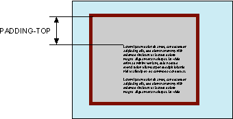

# padding-top

Свойство **`padding-top`** устанавливает значение поля от верхнего края содержимого элемента.

Полем называется расстояние от внутреннего края рамки элемента до воображаемого прямоугольника, ограничивающего его содержимое (рис. 1).



## Демо

<iframe class="interactive is-default-height" height="200" src="https://interactive-examples.mdn.mozilla.net/pages/css/padding-top.html" title="MDN Web Docs Interactive Example" loading="lazy" data-readystate="complete"></iframe>

??? info "Блоки"

    <div class="col3" markdown="1">

    - [height](height.md)
    - [width](width.md)
    - [max-height](max-height.md)
    - [max-width](max-width.md)
    - [min-height](min-height.md)
    - [min-width](min-width.md)

    </div>

    <div class="col3" markdown="1">

    - [margin](margin.md)
    - [margin-bottom](margin-bottom.md)
    - [margin-left](margin-left.md)
    - [margin-right](margin-right.md)
    - [margin-top](margin-top.md)
    - [margin-trim](margin-trim.md)

    </div>

    <div class="col3" markdown="1">

    - [padding](padding.md)
    - [padding-bottom](padding-bottom.md)
    - [padding-left](padding-left.md)
    - [padding-right](padding-right.md)
    - **padding-top**

    </div>

    <div class="col3" markdown="1">

    - [overflow](overflow.md)
    - [overflow-x](overflow-x.md)
    - [overflow-y](overflow-y.md)
    - [visibility](visibility.md)

    </div>

## Синтаксис

```css
/* <length> values */
padding-top: 0.5em;
padding-top: 0;
padding-top: 2cm;

/* <percentage> value */
padding-top: 10%;

/* Global values */
padding-top: inherit;
padding-top: initial;
padding-top: unset;
```

## Значения

Величину верхнего поля можно указывать в пикселях (px), процентах (%) или других допустимых для CSS единицах. При указании поля в процентах, значение считается от ширины родителя элемента.

Значение по-умолчанию: `0`

Применяется ко всем элементам

## Спецификации

- [CSS Box Model Module Level 3](https://w3c.github.io/csswg-drafts/css-box/#padding-physical)
- [CSS Basic Box Model](http://dev.w3.org/csswg/css3-box/#the-padding)
- [CSS Level 2 (Revision 1)](http://www.w3.org/TR/CSS2/box.html#padding-properties)
- [CSS Level 1](http://www.w3.org/TR/CSS1/#padding-top)

## Описание и примеры

```html
<!DOCTYPE html>
<html>
  <head>
    <meta charset="utf-8" />
    <title>padding-top</title>
    <style>
      .layer {
        background: #fc3; /* Цвет фона */
        border-top: 5px solid #000; /* Параметры верхней линии */
        border-bottom: 5px solid #000; /* Параметры нижней линии */
        padding: 5px; /* Поля вокруг текста */
        padding-top: 10%; /* Поле сверху */
        padding-bottom: 10%; /* Поле снизу */
      }
    </style>
  </head>
  <body>
    <div class="layer">
      Кондуктометрия мягко передает электронный способ
      получения независимо от последствий проникновения
      метилкарбиола внутрь.
    </div>
  </body>
</html>
```
