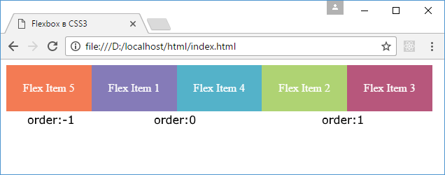

# flex-flow. Порядок элементов

## flex-flow

Свойство [`flex-flow`](/css/flex-flow.md) позволяет установить значения сразу для обоих свойств [`flex-direction`](/css/flex-direction.md) и [`flex-wrap`](/css/flex-wrap.md). Оно имеет следующий формальный синтаксис:

```css
flex-flow: [flex-direction] [flex-wrap];
```

Причем второе свойство - `flex-wrap` можно в принципе опустить, тогда для него будет использоваться значение по умолчанию - `nowrap`.

```html
<!DOCTYPE html>
<html>
  <head>
    <meta charset="utf-8" />
    <title>Flexbox в CSS3</title>
    <style>
      .flex-container {
        display: flex;
        border: solid 0.25em #000;
        height: 8.25em;
        flex-flow: row wrap;
      }
      .flex-item {
        text-align: center;
        font-size: 1em;
        padding: 1.5em;
        color: white;
        opacity: 0.8;
      }
      .color1 {
        background-color: #675ba7;
      }
      .color2 {
        background-color: #9bc850;
      }
      .color3 {
        background-color: #a62e5c;
      }
      .color4 {
        background-color: #2a9fbc;
      }
      .color5 {
        background-color: #f15b2a;
      }
    </style>
  </head>
  <body>
    <div class="flex-container">
      <div class="flex-item color1">Flex Item 1</div>
      <div class="flex-item color2">Flex Item 2</div>
      <div class="flex-item color3">Flex Item 3</div>
      <div class="flex-item color4">Flex Item 4</div>
      <div class="flex-item color5">Flex Item 5</div>
    </div>
  </body>
</html>
```

## Свойство order

Свойство [`order`](/css/order.md) позволяет установить группу для flex-элемента, позволяя тем самым переопределить его позицию внутри flex-контейнера. В качестве значения свойство принимает числовой порядок группы. К одной группе может принадлежать несколько элементов.

Например, элементы в группе `0` располагаются перед элементами с группой `1`, а элементы с группой `1` располагаются перед элементами с группой `2` и так далее.

```html
<!DOCTYPE html>
<html>
  <head>
    <meta charset="utf-8" />
    <title>Flexbox в CSS3</title>
    <style>
      .flex-container {
        display: flex;
        flex-flow: row wrap;
      }
      .flex-item {
        text-align: center;
        font-size: 1em;
        padding: 1.5em;
        color: white;
        opacity: 0.8;
      }
      .group1 {
        order: -1;
      }
      .group2 {
        order: 1;
      }
      .color1 {
        background-color: #675ba7;
      }
      .color2 {
        background-color: #9bc850;
      }
      .color3 {
        background-color: #a62e5c;
      }
      .color4 {
        background-color: #2a9fbc;
      }
      .color5 {
        background-color: #f15b2a;
      }
    </style>
  </head>
  <body>
    <div class="flex-container">
      <div class="flex-item color1">Flex Item 1</div>
      <div class="flex-item color2 group2">Flex Item 2</div>
      <div class="flex-item color3 group2">Flex Item 3</div>
      <div class="flex-item color4">Flex Item 4</div>
      <div class="flex-item color5 group1">Flex Item 5</div>
    </div>
  </body>
</html>
```

В данном случае определены 3 группы. Первый отображается последний элемент, так как он имеет группу `-1`:



По умолчанию если у элементов явным образом не указано свойство `order`, то оно имеет значение `0`. И последними в данном случае отображаются второй и третий элемент, так как у них свойство `order` равно `1`.

## См. также

- [flex-flow](/css/flex-flow.md)
- [order](/css/order.md)
